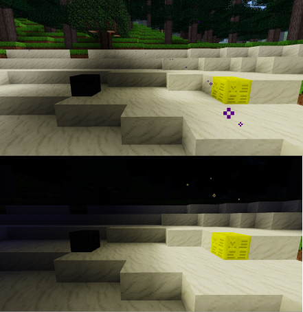

# Minetest : Aura

A WIP mod to add aura-like blocks and properties.

## Nodes

* Dark Aura Stone
	* craft using 8 obsidian blocks around a mese crystal.
	* Causes an aura of darkness to be continually cast around the node
* Bright Aura Stone
	* craft using 8 mese lamps around a mese crystal.
	* Causes an aura of birghtness to be continually cast around the node

## Commands/Items

Players with the `give` privilege can invoke two commands: `/darken` and `/brighten`

ROADMAP: These will eventually be moved into consumable items to be used on their own.

## API

Two API functions are for general use:

* `aura.darken(pos, range)`
	* Cast a dark area around pos. Default range is 5

* `aura.brighten(pos, range)`
	* Cast a bright area around pos. Default range is 5

### Mobs Redo API

Two API functions can be passed directly as a `do_custom` function for [`mobs_redo`](https://github.com/tenplus1/mobs_redo) mobs.

The value in the dtime parameter should be the time since the function was last called for the entity.

* `aura.darkness_shroud(mob_entity, dtime)`
	* darken the area around the mob's position

* `aura.holy_glow(mob_entity, dtime)`
	* brighten the area around the mob's position

Just assign one of the functions to the `do_custom` property for your mob to benefit from the aura.

If the `aura_interval` is set, this is the interval in seconds at which the aura will manifest. By default, this is 1 second.

If the mob's entity table has an `aura_effect(self)` handler associated with it, then that handler will be called when the aura is manifested.

Example:

	...
	do_custom = aura.holy_glow,
	aura_interval = 2,
	aura_effect = function(self)
		minetest.add_item(self:getpos(), "default:apple")
	end,
	...
